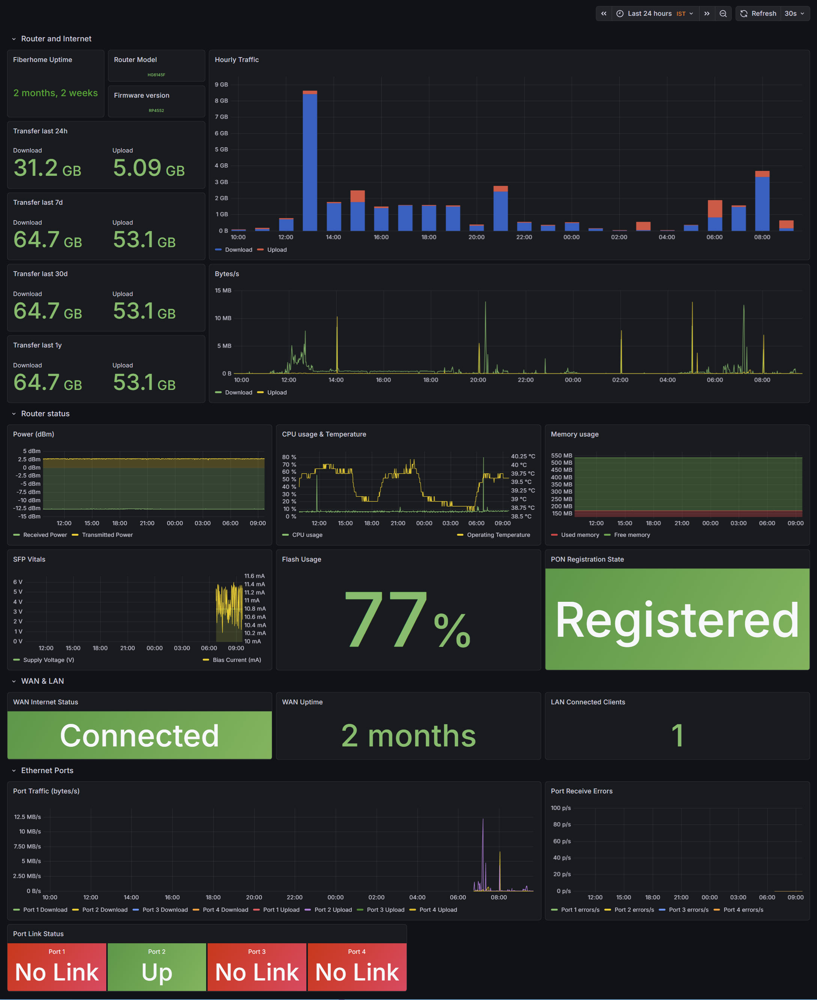

# 📡 Prometheus exporter for the FiberHome HG6145F GPON Fiber Routers

[](https://github.com/mcbyte-it/fiberhome_exporter/blob/master/LICENSE)


[](https://hub.docker.com/r/mcbyteit/fiberhome_exporter)
[](https://hub.docker.com/r/mcbyteit/fiberhome_exporter)

This is a simple prometheus exporter for the FiberHome HG6145F GPON home router. The exporter uses the webui credentials to access the router json API's and get the required data.

The exporter should work with the HG6145F devices, possibiliy some other models by Fiberhome that uses the same UI.

It has been tested against my own FiberHome HG6145F, running from within a Docker container and connected to Prometheus for data collection. Data visualization has been done with Grafana.

[](docs/grafana_screenshot.jpg)

## 🎯 Purpose & Disclaimer

This project was born out of a personal necessity: I wanted to collect statistics from the fiber router I use at home. There is no malicious intent whatsoever — no hacking, no exploitation, no reverse engineering of any firmware.

The exporter was built by observing the network calls the router's own web UI makes to its local JSON API, then replicating those calls to collect statistics. During that process I had the opportunity to understand how the login flow works, but nothing is being exploited — credentials are only used to authenticate exactly as a browser would. The router password cannot be changed through this tool, and no firmware was reverse engineered.

✅ If you are looking for a way to monitor your FiberHome router with Prometheus and Grafana, this is the right tool.
🚫 If you are looking for a hacking or exploitation tool, this is not it.

## 🔨 Build

To use and build this exporter, you need to first clone this reposiroty and create a docker image from the sources

### Clone the main branch:
```
git clone https://github.com/mcbyte-it/fiberhome_exporter.git
```

### Build a docker 🐳
```
cd fiberhome_exporter
docker build -t fiberhome_exporter:latest .
```

## 🚀 Run in docker

To run this image I used a docker-compose file.

**⚠️ Be sure to set the environmental variables as in the compose file below**

```
services:
  fiberhome_exporter:
    image: mcbyteit/fiberhome_exporter:latest
    environment:
      ROUTER_IP: 'http://192.168.1.1'
      ROUTER_USERNAME: 'admin'
      ROUTER_PASSWORD: 'admin1234'
    ports:
      - 6145:6145
    restart: unless-stopped
```

### ⚙️ Environment Variables

| Variable | Required | Default | Description |
|---|---|---|---|
| `ROUTER_IP` | No | `http://192.168.1.1` | Base URL of the router web UI. Use `http://` followed by the router's LAN IP address. |
| `ROUTER_USERNAME` | No | `admin` | Router web UI username. |
| `ROUTER_PASSWORD` | **Yes** |  | Router web UI password. Should be changed to your actual router password. |
| `PORT` | No | `6145` | Port the Prometheus metrics HTTP server listens on inside the container. |
| `LOG_FILE` | No | `/logs/collector.log` | Path to the log file inside the container. Mount a volume to this path to persist logs. |

In prometheus.yml file, add the following section to allow data scraping from this exporter:
```  - job_name: 'fiberhome-exporter'
    scrape_interval: 15s
    static_configs:
      - targets: ['fiberhome_exporter:6145']
```


[](https://github.com/mcbyte-it/fiberhome_exporter/stargazers)
[](https://github.com/mcbyte-it/fiberhome_exporter/network/members)
[](https://github.com/mcbyte-it/fiberhome_exporter/issues)
[](https://github.com/mcbyte-it/fiberhome_exporter/commits/master)